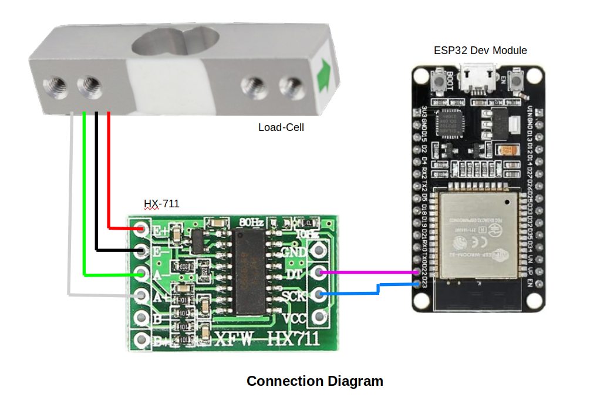

# Smart Weight Scale with ESP32 and Bluetooth BLE

**Introduction:**

Tracking your weight goals and progress can be difficult without accurate data. In this guide, we’ll walk through how to build your own smart weight scale using an ESP32 and Bluetooth BLE. Creating your own connected scale is an excellent way to monitor your fitness routine and health goals. Plus, it’s a fun electronics project!

**Prerequisites:**

1. ESP32 Development Board
2. Load Cell and HX711 Amplifier
3. VSCode with PlatformIO (IDE) installed
4. Wiring diagram:


<br><br>

**Step 1: Connect the Hardware:**

Follow the wiring diagram above to connect the ESP32 with the load cell and HX711 amplifier. Key connections are as follow:

- HX711 CLK pin to ESP32 GPIO 23
- HX711 DOUT pin to ESP32 GPIO 22
- Use color coded wire for connection between Load cell and HX711
<br><br>

**Step 2: Set Up VSCode with PlatformIO:**

We'll use PlatformIO as the IDE to code and upload the firmware to the ESP32. Install VSCOde and PlatformIO extension to get started. Create a new project for your smart scale application.
<br><br>

**Step 3: Install the Libraries:**

In `platformio.ini`, add dependencies for the HX711 and BLE Arduino libraries:

```ini
[env:esp32dev]
platform = espressif32
board = esp32dev
framework = arduino

; uncomment port config for linux platform
;upload_port = /dev/ttyACM0
;upload_speed = 115200

; BLE stack requires a huge space
; uncomment following line if you get low memory error, but you'll loose OTA capability
;board_build.partitions = huge_app.csv

lib_deps = 
  https://github.com/olkal/HX711_ADC
```
<br>

**Step 4: Write the Code:**

In BLE communication, a Service UUID (Universally Unique Identifier) is a crucial component. BLE device typically exposes its functionality and data through a hierarchy of services and characteristics. Each service is identified by a unique UUID, and within each service, there can be multiple characteristics, each with its own UUID. 

Our weight scale BLE device will have a "Weight Measurement" service with the standard UUID - 0000181D-0000-1000-8000-00805F9B34FB and within this service, a characteristic like "Weight Value" with the UUID - 00002A9D-0000-1000-8000-00805F9B34FB. The client device (e.g., a smartphone) would use these UUIDs to identify and interact with the specific services and characteristics offered by the weight scale.

```arduino
#define SERVICE_UUID        "0000181D-0000-1000-8000-00805f9b34fb"
#define MEASURE_CHAR_UUID   "00002A9D-0000-1000-8000-00805f9b34fb"
```

Initialize the components:

```arduino
// HX711 connection pins
#define SCK  23  //SCK OUTPUT
#define DT   22  //DT INPUT

HX711_ADC LoadCell(DT, SCK);

BLEServer* pServer = NULL;
BLECharacteristic* pCharacteristic = NULL;
BLEDescriptor *pDescr;
BLE2902 *pBLE2902;
```
<br>


Let's look at some key sections of the code:

Set up the HX711 scale and calibrate the sensor readings:

```arduino
  //initialize loadcell
  LoadCell.begin();
  LoadCell.start(2000, true);  //stabilize and tare on start
  delay(200);

  Serial.println("\nInitializing LoadCell...");
  if (LoadCell.getTareTimeoutFlag() || LoadCell.getSignalTimeoutFlag()) {
    Serial.println("\nTimeout, check wiring for MCU <> HX711");
  } else {
    Serial.println("\nSetting CalFactor...");
    LoadCell.setCalFactor(preSetCalibValue);  // set calibration value
  }

  //initialize BLE server
  const char* dev_name = "WEIGHT-SCALE";  // set device name

  // Create the BLE Device
  BLEDevice::init(dev_name);

  // Create the BLE Server
  pServer = BLEDevice::createServer();
  pServer->setCallbacks(new MyServerCallbacks());

  // Create the BLE Service
  BLEService *pService = pServer->createService(SERVICE_UUID);

  // Create a BLE Weight-measurement Characteristic
  pCharacteristic = pService->createCharacteristic(
                      MEASURE_CHAR_UUID,
                      BLECharacteristic::PROPERTY_READ   |
                      BLECharacteristic::PROPERTY_NOTIFY
                    );                   

  // Create a BLE Descriptor
  pDescr = new BLEDescriptor((uint16_t)0x2901);
  pDescr->setValue(dev_name);  // setting same as device name
  pCharacteristic->addDescriptor(pDescr);
  
  pBLE2902 = new BLE2902();
  pBLE2902->setNotifications(true);
  
  // Add all Descriptors here
  pCharacteristic->addDescriptor(pBLE2902);
  pCharacteristic->setNotifyProperty(true);

  // Start the service
  pService->start();

  // Start advertising
  BLEAdvertising *pAdvertising = BLEDevice::getAdvertising();
  pAdvertising->addServiceUUID(SERVICE_UUID);
  pAdvertising->setScanResponse(true);
  pAdvertising->start();
  Serial.println("Waiting for a BLE client to notify...\n");
```

Read the weight and broadcast via BLE:

```arduino
// Get weight data
float weight = scale.get_units();

// Broadcast via BLE
bleDev.broadcastWeight(weight);
```
<br>

**Step 5: Upload the Firmware**

With everything wired up and coded, upload the firmware to your ESP32 via USB.
<br><br>

**Step 6: Test It Out and Calibration**

Place some known weights on the scale and verify the readings are accurate. Check that the values are being broadcast over BLE as expected.
<br><br>

**Conclusion**

In this project, we built a smart Bluetooth-BLE scale with an ESP32 and load cell sensor. Stay tuned for a future guide on developing an Android app to display and track the weight data. 

Let me know if you have any other questions!
